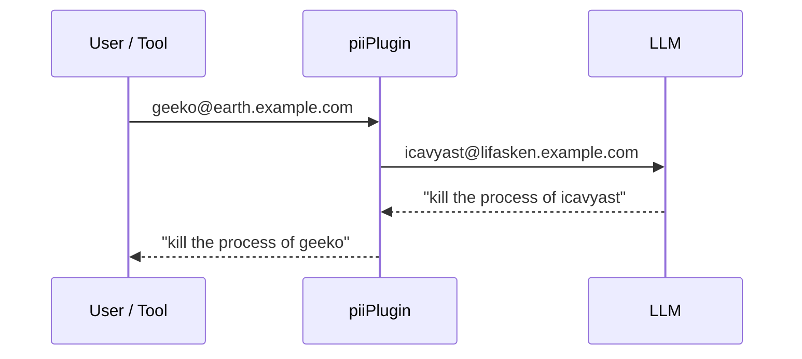

# piiPlugin

piiPlugin is a PII (Personally Identifiable Information) **removal** plugin system for
[Google ADK](https://google.github.io/adk-docs/) agents. It redacts sensitive
data before it is sent to the model and restores the original values before they
reach the tools — so the LLM never sees real user names, hosts or mail
addresses, while the tools still run against the real system.

---

## Table of contents

- [How it works](#how-it-works)
- [Example](#example)
- [Usage](#usage)
- [Testing](#testing)
- [Limitations](#limitations)
- [Dependencies](#dependencies)
- [License](#license)

---

## How it works

piiPlugin hooks into the plugin architecture of the ADK and sits between the model
on one side and the user and the tools on the other side. It ships three filters
that share a common interface and can be used separately or all at once:

| Filter | Package | What it recognises | Where the names come from |
| --- | --- | --- | --- |
| **User names** | `filter/username` | Login names and the names in the GECOS field | The system user database via `getpwent(3)` (the same source as `getent passwd`), restricted to UID ≥ 1000 |
| **Host names** | `filter/host` | Host names, domains and FQDNs | The local host name and domain, the `NS` and `MX` records of that domain, reverse lookups of the local interface addresses and `/etc/hosts` |
| **eMail addresses** | `filter/email` | Anything matching an address pattern, including local addresses without a TLD such as `goo@baar` | Detected by a regular expression, no pre-filled list |

Filters that work on a fixed list of names embed `filter.UniqueNamesPlugin`,
which compiles the list into one case-insensitive regular expression — sorted by
length descending so longer names match before their own prefixes — and
implements all callbacks. Adding a new list-based filter means collecting the
names and calling `InitRegex`.

### The shared replacement table

All filters work on one common replacement table — a `map[string]string` whose
key is the generated replacement and whose value is the original string.
Since the map is passed around as a pointer, every filter can read and extend
what the others have already mapped, which keeps redaction and unredaction
consistent across filters. Mail addresses therefore reuse the replacements the
user name and host filters have already chosen.

Replacements are generated with the APG algorithm, so they are pronounceable
rather than random gibberish, which keeps them stable for the LLM to reason
about. A generated replacement is:

- at least 8 characters long, and never longer than 255;
- checked against the whole input, so it can never collide with real text;
- unique within the replacement table;
- cased like the original (`Gekkonidae` → `Aphomyigji`).

### Callback flow

The composite plugin registers all six ADK plugin callbacks and dispatches them
to the enabled filters:

| Callback | Direction | What happens |
| --- | --- | --- |
| `BeforeModelCallback` | leaving the machine | Redacts the text of every request part |
| `AfterModelCallback` | coming back | Restores the original values in the response |
| `BeforeToolCallback` | coming back | Restores the original values in the tool arguments, so the tool runs against the real system |
| `AfterToolCallback` | leaving the machine | Redacts the tool result *and* the arguments again, since both stay in the session and are resent with every following request |
| `OnToolErrorCallback` | leaving the machine | Turns the error into a redacted `{"error": …}` result |
| `OnModelErrorCallback` | leaving the machine | Pass-through in the individual filters |

Data that leaves the machine passes the filters in the order
**user name → eMail → host**; incoming data passes them in the reverse order.



> [!IMPORTANT]
> `OnToolErrorCallback` has to return a result, and returning one ends the
> callback chain of the ADK runner. Filters that should redact tool errors
> together therefore have to be combined with `piiplugin.NewPiiPlugin()` — if
> they are registered individually with the runner, only the first one sees a
> tool error.

---

## Example

Assume the following entry in `/etc/passwd`

```text
geeko:x:1234:1234:Gekkonidae Sauropsida:/home/geeko:/bin/bash
```

on a host named `earth.example.com`. The replacement table is then pre-filled
with something like the following — the names differ on every run, as they are
generated randomly:

```text
icavyast   -> geeko        # minimum length is 8
Aphomyigji -> Gekkonidae   # capitalisation is preserved
Larbucheba -> Sauropsida
lifasken   -> earth
coksoosi   -> example
```

This keeps the connections between the values intact: a process belonging to
`geeko` is reported as belonging to `icavyast`, with the home directory
`/home/icavyast`, and a message to `geeko@earth` is mapped consistently to
`icavyast@lifasken`.

By default the TLD of a mail address is left alone, because invalid TLDs confuse
LLMs. Use `WithTLDSuffix` if you want it replaced as well.

> [!NOTE]
> The semantic connection between `geeko` and `Gekkonidae` is lost — there is
> none between `icavyast` and `Aphomyigji`.

---

## Usage

### Programmatic (composite plugin)

```go
import "github.com/openSUSE/piiplugin/piiplugin"

// All filters enabled, sharing one replacement table.
plug := piiplugin.NewPiiPlugin()

// Disable individual filters.
plug = piiplugin.NewPiiPlugin(
    piiplugin.WithoutEmail(),
    piiplugin.WithoutHost(),
    piiplugin.WithoutUsername(),
)
```

Register the result like any other ADK plugin:

```go
config := &launcher.Config{
    AgentLoader:    agent.NewSingleLoader(a),
    SessionService: sessionService,
    PluginConfig:   runner.PluginConfig{Plugins: []*plugin.Plugin{plug}},
}
```

### Programmatic (individual filters)

Every filter can also be created on its own. Pass the same
`*map[string]string` to all of them to share one replacement table:

```go
import (
    filteremail "github.com/openSUSE/piiplugin/filter/email"
    filterhost "github.com/openSUSE/piiplugin/filter/host"
    filterusername "github.com/openSUSE/piiplugin/filter/username"
)

// Can be pre-filled. If key == value is used, the name is "white listed" (not replaced).
replacements := make(map[string]string)

userPlug, err := filterusername.NewUsernamePlugin(
    filterusername.WithReplacement(&replacements),
)
hostPlug, err := filterhost.NewHostPlugin(
    filterhost.WithReplacement(&replacements),
    filterhost.WithDomain("example.com"),
)
mailPlug, err := filteremail.NewEmailPlugin(
    filteremail.WithReplacement(&replacements),
    filteremail.WithTLDSuffix(map[string]string{"*": "invalid"}),
)
```

| Filter | Option | Description |
| --- | --- | --- |
| all | `WithReplacement(*map[string]string)` | Use a shared, possibly pre-filled replacement table |
| username | `WithGetpasswdFunc(func() ([]string, error))` | Replace the `getpwent` lookup with a custom source of `passwd`-style lines |
| host | `WithDomain(string)` | Set the local domain instead of auto-detecting it |
| host | `WithDNSServer(string)` | Query a specific nameserver (port defaults to `53`) |
| host | `WithResolver(*net.Resolver)` | Use a custom resolver for all lookups |
| host | `WithLookupFunc(func(string) ([]string, error))` | Replace the whole host discovery |
| email | `WithTLDSuffix(map[string]string)` | Map TLDs to replacements; the key `"*"` sets the fallback for all others |

### Disable certain names

In some cases some user names should not be replaced. Although there is no whitelist to filter out names that should not be filtered, this can be achieved by adding them to the replacement table with key == value (these are never replaced).

### Agent demo

The repository root contains a small demo agent that exposes a `get_processes`
tool — a good way to see the filters at work, since `ps` output is full of user
names.

```bash
go run . console                            # interactive console session
go run . -p "which processes use most RAM?" # answer a single prompt and exit
go run . console --disable-username-plugin  # start without the user name filter
go run .                                    # print the usage of the launcher
```

| Option | Description |
| --- | --- |
| `-p`, `--prompt PROMPT` | Answer a single prompt, print the response and exit |
| `--disable-username-plugin` | Run without the user name PII filter |

All remaining arguments are handed over to the ADK launcher (`console`, `web`, …).

Environment configuration:

| Variable | Default | Description |
| --- | --- | --- |
| `OLLAMA_URL` | `http://localhost:3741/v1` | OpenAI-compatible base URL of the Ollama API |
| `OLLAMA_MODEL` | `default:latest` | Model to use |

> [!NOTE]
> The demo currently registers only the user name filter, not the composite
> plugin. Sessions are stored in `sessions.db` in the working directory.

### Name generator CLI

The pronounceable names can also be generated on their own:

```bash
go run ./names/cmd -length 12 -count 5
```

---

## Testing

```bash
go test ./...
```

Set `filter.UseMock = true` to make the generator return the reversed original
instead of a random name, which keeps test expectations readable.

---

## Limitations

- The host filter does not enumerate a whole zone; it only finds the hosts the
  resolver is willing to report (`NS`, `MX`, reverse lookups, `/etc/hosts`).
- The user name filter needs cgo and a POSIX user database, so it is Linux/Unix
  only.
- Only names known at startup are redacted. Values that first appear in a tool
  result — for instance a user name of a UID below 1000 — are not recognised.
- The replacement table lives in memory for the lifetime of the process and is
  not persisted between runs.
- `filter.Store` (with `MapStore` and `FileStore`) sketches a pluggable backend
  for the replacement table, but the filters do not use it yet.

---

## Dependencies

- `google.golang.org/adk/v2` — Google Agent Development Kit
- `google.golang.org/genai` — Generative AI SDK
- `gorm.io/gorm` + `gorm.io/driver/sqlite` — session storage
- `github.com/toon-format/toon-go` — TOON data format serialisation
- `github.com/jabenninghoff/apg` — Mirror for automated password generator

---

## License

MIT — see [LICENSE](LICENSE).

## Acknowledgements

This project was developed with the help of different LLMs.

